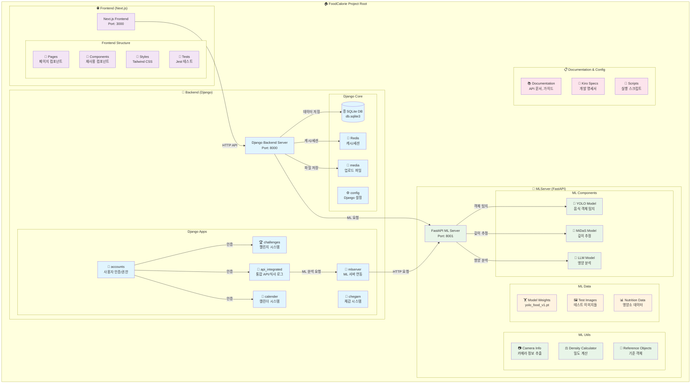
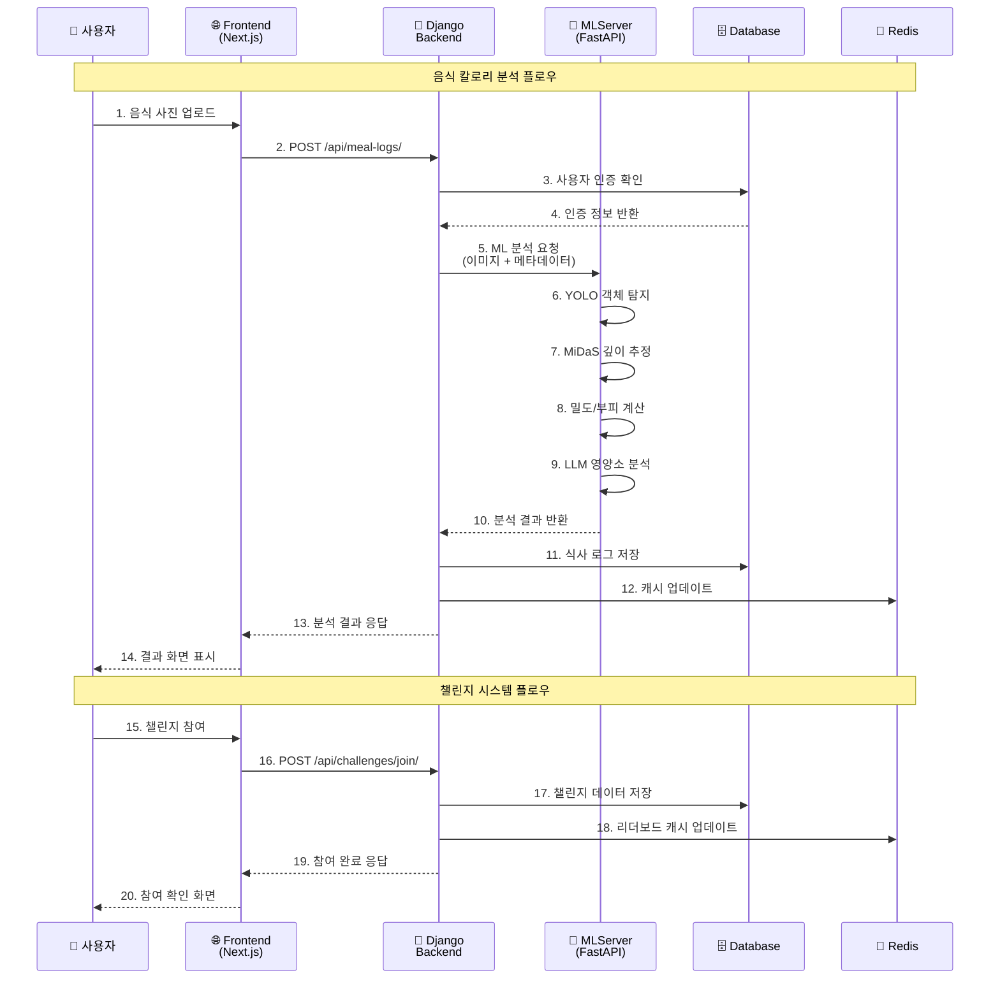
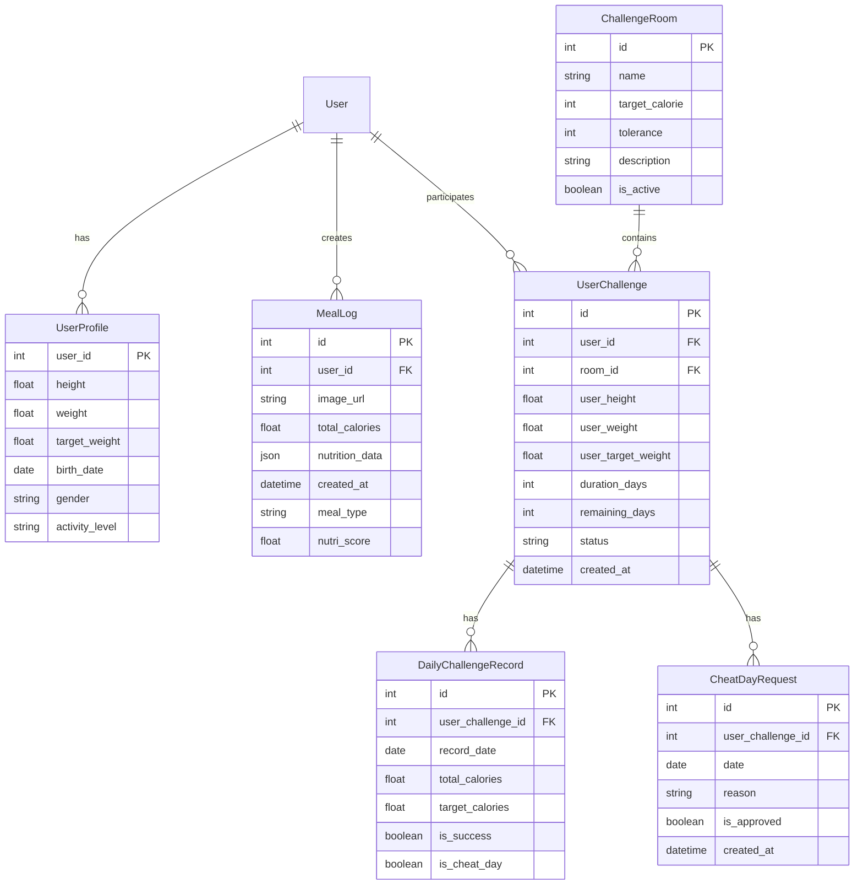
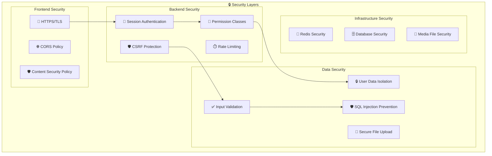
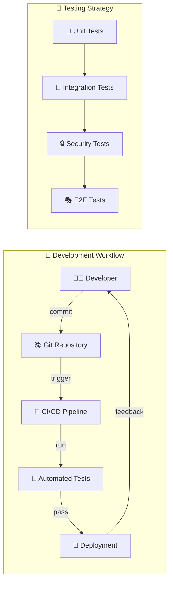

# FoodCalorie 프로젝트 전체 구조

## 프로젝트 아키텍처 다이어그램



## 시스템 플로우 다이어그램



## 데이터베이스 구조



## API 엔드포인트 구조

```mermaid
graph LR
    subgraph "🔧 Django API Endpoints"
        subgraph "👤 Authentication (/api/accounts/)"
            A1[POST /login/]
            A2[POST /logout/]
            A3[POST /register/]
            A4[GET /profile/]
            A5[PUT /profile/]
        end
        
        subgraph "🍽️ Meal Logs (/api/meal-logs/)"
            M1[GET /]
            M2[POST /]
            M3[GET /{id}/]
            M4[PUT /{id}/]
            M5[DELETE /{id}/]
        end
        
        subgraph "🏆 Challenges (/api/challenges/)"
            C1[GET /rooms/]
            C2[POST /join/]
            C3[GET /my/]
            C4[POST /leave/]
            C5[POST /cheat/]
            C6[GET /leaderboard/{room_id}/]
            C7[GET /stats/]
        end
        
        subgraph "📅 Calendar (/api/calendar/)"
            CAL1[GET /events/]
            CAL2[POST /events/]
            CAL3[PUT /events/{id}/]
            CAL4[DELETE /events/{id}/]
        end
    end
    
    subgraph "🤖 MLServer API (/api/ml/)"
        ML1[POST /analyze-food/]
        ML2[POST /estimate-mass/]
        ML3[GET /health/]
        ML4[POST /batch-analyze/]
    end
```

## 보안 아키텍처



## 배포 아키텍처

```mermaid
graph TB
    subgraph "🌐 Production Environment"
        subgraph "Load Balancer"
            LB[⚖️ Nginx Load Balancer]
        end
        
        subgraph "Application Servers"
            App1[🔧 Django App Server 1]
            App2[🔧 Django App Server 2]
            ML1[🤖 MLServer Instance 1]
            ML2[🤖 MLServer Instance 2]
        end
        
        subgraph "Static Assets"
            Static[📁 Static Files<br/>(Nginx)]
            Media[📁 Media Files<br/>(Nginx)]
        end
        
        subgraph "Database Layer"
            PrimaryDB[(🗄️ Primary Database)]
            ReplicaDB[(🗄️ Read Replica)]
            RedisCluster[🔴 Redis Cluster]
        end
        
        subgraph "Monitoring"
            Logs[📊 Log Aggregation]
            Metrics[📈 Metrics Collection]
            Alerts[🚨 Alert System]
        end
    end
    
    LB --> App1
    LB --> App2
    LB --> ML1
    LB --> ML2
    
    App1 --> PrimaryDB
    App2 --> ReplicaDB
    App1 --> RedisCluster
    App2 --> RedisCluster
    
    App1 --> Logs
    App2 --> Logs
    ML1 --> Logs
    ML2 --> Logs
```

## 개발 워크플로우


