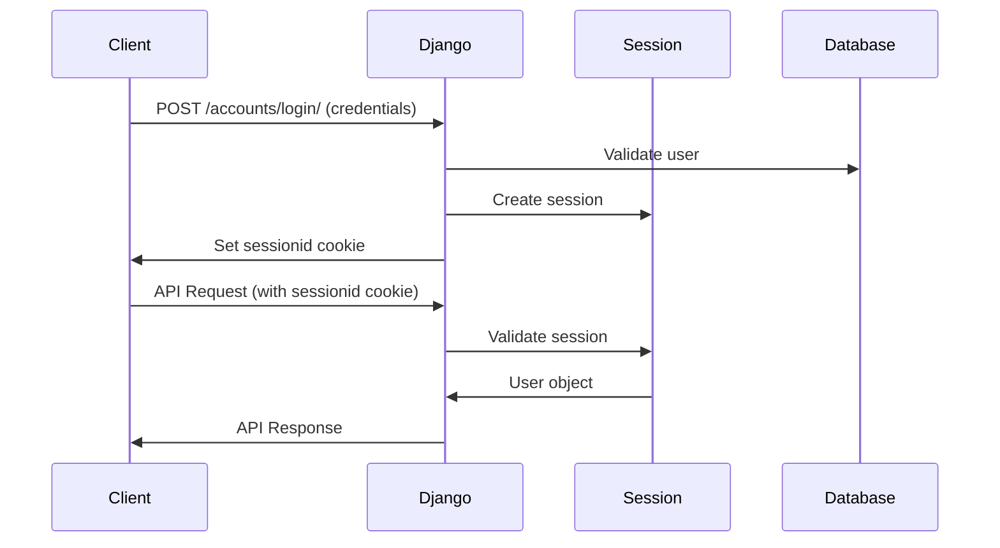

# Challenge System API Documentation

## Overview

Challenge 시스템은 Django 세션 기반 인증을 사용하여 사용자가 칼로리 챌린지에 참여하고 관리할 수 있는 API를 제공합니다. 모든 보호된 API는 세션 인증이 필요하며, 일관된 응답 형식을 사용합니다.

## Authentication

### Session-Based Authentication

Challenge API는 Django 세션 기반 인증을 사용합니다:

- **인증 방식**: Django Session Authentication
- **CSRF 보호**: 활성화됨 (POST/PUT/DELETE 요청 시 CSRF 토큰 필요)
- **세션 쿠키**: `sessionid` 쿠키를 통해 인증 상태 유지
- **권한 클래스**: `accounts.permissions.IsAuthenticatedWithProperError` 사용

### Authentication Requirements

| API Category | Authentication Required | Permission Class |
|--------------|------------------------|------------------|
| 공개 API (리더보드, 챌린지 방 목록) | ❌ No | `AllowAny` |
| 보호된 API (참여, 내 현황, 관리) | ✅ Yes | `IsAuthenticatedWithProperError` |

### Session Authentication Flow



### Authentication Usage Examples

#### 1. 로그인 후 챌린지 참여

```javascript
// 1. 먼저 로그인
const loginResponse = await fetch('/accounts/login/', {
    method: 'POST',
    headers: {
        'Content-Type': 'application/json',
        'X-CSRFToken': getCsrfToken()
    },
    credentials: 'include', // 세션 쿠키 포함
    body: JSON.stringify({
        username: 'user@example.com',
        password: 'password123'
    })
});

// 2. 로그인 성공 후 챌린지 참여 (세션 자동 사용)
const joinResponse = await fetch('/api/challenges/join/', {
    method: 'POST',
    headers: {
        'Content-Type': 'application/json',
        'X-CSRFToken': getCsrfToken()
    },
    credentials: 'include', // 세션 쿠키 자동 포함
    body: JSON.stringify({
        room_id: 1,
        user_height: 170,
        user_weight: 70,
        user_target_weight: 65,
        user_challenge_duration_days: 30,
        user_weekly_cheat_limit: 1
    })
});
```

#### 2. 인증된 상태에서 API 호출

```javascript
// 세션이 유효한 상태에서 내 챌린지 조회
const myChallenge = await fetch('/api/challenges/my/', {
    method: 'GET',
    credentials: 'include' // 세션 쿠키 포함
});

if (myChallenge.ok) {
    const data = await myChallenge.json();
    console.log('내 챌린지:', data.data.active_challenges);
}
```

#### 3. CSRF 토큰 처리

```javascript
// CSRF 토큰 가져오기
function getCsrfToken() {
    return document.querySelector('[name=csrfmiddlewaretoken]').value;
}

// POST 요청 시 CSRF 토큰 포함
const response = await fetch('/api/challenges/leave/', {
    method: 'POST',
    headers: {
        'Content-Type': 'application/json',
        'X-CSRFToken': getCsrfToken()
    },
    credentials: 'include',
    body: JSON.stringify({
        challenge_id: 123
    })
});
```

## Error Response Formats

### Authentication Errors (401 Unauthorized)

세션이 만료되거나 인증이 필요한 경우:

```json
{
    "success": false,
    "message": "인증이 필요합니다. 다시 로그인해주세요.",
    "error_code": "AUTHENTICATION_REQUIRED",
    "redirect_url": "/login",
    "session_info": {
        "authenticated": false,
        "session_expired": true,
        "should_redirect": true,
        "failed_at": "2025-01-29T10:30:00Z"
    }
}```


### Permission Errors (403 Forbidden)

권한이 부족한 경우:

```json
{
    "success": false,
    "message": "이 기능을 사용할 권한이 없습니다.",
    "error_code": "PERMISSION_DENIED",
    "required_permission": "authenticated_user"
}
```

### CSRF Errors (403 Forbidden)

CSRF 토큰이 누락되거나 잘못된 경우:

```json
{
    "success": false,
    "message": "CSRF 토큰이 유효하지 않습니다.",
    "error_code": "CSRF_FAILED",
    "details": "CSRF verification failed. Request aborted."
}
```

### Validation Errors (400 Bad Request)

입력 데이터 검증 실패:

```json
{
    "success": false,
    "error_code": "VALIDATION_ERROR",
    "message": "입력 데이터가 올바르지 않습니다.",
    "details": {
        "user_height": ["키는 100cm~250cm 사이여야 합니다."],
        "room_id": ["존재하지 않는 챌린지 방입니다."]
    }
}
```

### Business Logic Errors (400 Bad Request)

비즈니스 로직 오류:

```json
{
    "success": false,
    "error_code": "ALREADY_PARTICIPATING",
    "message": "이미 \"30일 칼로리 챌린지\" 챌린지에 참여 중입니다. 하나의 챌린지만 참여할 수 있습니다."
}
```

### Server Errors (500 Internal Server Error)

서버 내부 오류:

```json
{
    "success": false,
    "error_code": "SERVER_ERROR",
    "message": "챌린지 참여 중 오류가 발생했습니다."
}
```

## API Endpoints

### Public APIs (인증 불필요)

#### 1. 챌린지 방 목록 조회

**GET** `/api/challenges/rooms/`

활성화된 챌린지 방 목록을 조회합니다.

**Permission**: `AllowAny`

**Response**:
```json
{
    "count": 2,
    "next": null,
    "previous": null,
    "results": [
        {
            "id": 1,
            "name": "30일 칼로리 챌린지",
            "target_calorie": 2000,
            "tolerance": 100,
            "description": "30일 동안 목표 칼로리를 지켜보세요!",
            "is_active": true,
            "created_at": "2025-01-01T00:00:00Z",
            "dummy_users_count": 10,
            "participant_count": 25
        }
    ]
}
```

#### 2. 리더보드 조회

**GET** `/api/challenges/leaderboard/{room_id}/`

특정 챌린지 방의 리더보드를 조회합니다.

**Permission**: `AllowAny`

**Parameters**:
- `room_id` (path): 챌린지 방 ID
- `limit` (query, optional): 조회할 참가자 수 (기본값: 50, 최대: 100)

**Response**:
```json
{
    "success": true,
    "message": "30일 칼로리 챌린지 리더보드를 조회했습니다.",
    "data": {
        "room_id": 1,
        "room_name": "30일 칼로리 챌린지",
        "leaderboard": [
            {
                "rank": 1,
                "username": "user1",
                "user_id": 123,
                "current_streak": 15,
                "max_streak": 20,
                "total_success_days": 25,
                "challenge_start_date": "2025-01-01",
                "last_activity": "2025-01-29"
            }
        ],
        "my_rank": null,
        "total_participants": 25
    }
}
```

### Protected APIs (인증 필요)

#### 3. 챌린지 참여

**POST** `/api/challenges/join/`

새로운 챌린지에 참여합니다.

**Permission**: `IsAuthenticatedWithProperError`

**Request Body**:
```json
{
    "room_id": 1,
    "user_height": 170,
    "user_weight": 70,
    "user_target_weight": 65,
    "user_challenge_duration_days": 30,
    "user_weekly_cheat_limit": 1,
    "min_daily_meals": 2,
    "challenge_cutoff_time": "23:00"
}
```

**Success Response (201)**:
```json
{
    "success": true,
    "message": "챌린지 참여가 완료되었습니다.",
    "data": {
        "id": 456,
        "room_name": "30일 칼로리 챌린지",
        "room_target_calorie": 2000,
        "username": "user123",
        "user_height": 170,
        "user_weight": 70,
        "user_target_weight": 65,
        "user_challenge_duration_days": 30,
        "user_weekly_cheat_limit": 1,
        "current_streak_days": 0,
        "max_streak_days": 0,
        "remaining_duration_days": 30,
        "current_weekly_cheat_count": 0,
        "total_success_days": 0,
        "total_failure_days": 0,
        "status": "active",
        "challenge_start_date": "2025-01-29",
        "challenge_end_date": "2025-02-28",
        "is_active": true
    }
}
```

**Error Response (400) - Already Participating**:
```json
{
    "success": false,
    "error_code": "VALIDATION_ERROR",
    "message": "입력 데이터가 올바르지 않습니다.",
    "details": {
        "non_field_errors": ["이미 \"30일 칼로리 챌린지\" 챌린지에 참여 중입니다. 하나의 챌린지만 참여할 수 있습니다."]
    }
}
```

#### 4. 내 챌린지 현황 조회

**GET** `/api/challenges/my/`

현재 참여 중인 챌린지 현황을 조회합니다.

**Permission**: `IsAuthenticatedWithProperError`

**Success Response (200)**:
```json
{
    "success": true,
    "message": "챌린지 현황을 조회했습니다.",
    "data": {
        "active_challenges": [
            {
                "id": 456,
                "room_name": "30일 칼로리 챌린지",
                "room_target_calorie": 2000,
                "username": "user123",
                "current_streak_days": 5,
                "max_streak_days": 8,
                "remaining_duration_days": 25,
                "total_success_days": 5,
                "total_failure_days": 0,
                "status": "active",
                "challenge_start_date": "2025-01-29",
                "challenge_end_date": "2025-02-28",
                "is_expired": false,
                "days_since_start": 5,
                "cheat_remaining": 1
            }
        ],
        "has_active_challenge": true,
        "total_active_count": 1
    }
}
```

**No Active Challenge Response (200)**:
```json
{
    "success": true,
    "message": "참여 중인 챌린지가 없습니다.",
    "data": {
        "active_challenges": [],
        "has_active_challenge": false
    }
}
```

#### 5. 챌린지 포기

**POST** `/api/challenges/leave/`

참여 중인 챌린지를 포기합니다.

**Permission**: `IsAuthenticatedWithProperError`

**Request Body**:
```json
{
    "challenge_id": 456
}
```

**Success Response (200)**:
```json
{
    "success": true,
    "message": "\"30일 칼로리 챌린지\" 챌린지를 포기했습니다.",
    "data": {
        "challenge_id": 456,
        "room_name": "30일 칼로리 챌린지",
        "user": "user123"
    }
}
```

**Error Response (404) - Challenge Not Found**:
```json
{
    "success": false,
    "error_code": "CHALLENGE_NOT_FOUND",
    "message": "해당 챌린지를 찾을 수 없습니다."
}
```

#### 6. 챌린지 기간 연장

**PUT** `/api/challenges/extend/`

참여 중인 챌린지의 기간을 연장합니다.

**Permission**: `IsAuthenticatedWithProperError`

**Request Body**:
```json
{
    "challenge_id": 456,
    "extend_days": 7
}
```

**Success Response (200)**:
```json
{
    "success": true,
    "message": "챌린지가 7일 연장되었습니다.",
    "data": {
        "id": 456,
        "room_name": "30일 칼로리 챌린지",
        "remaining_duration_days": 32,
        "user_challenge_duration_days": 37,
        "challenge_end_date": "2025-03-07"
    }
}
```

#### 7. 치팅 요청

**POST** `/api/challenges/cheat/`

특정 날짜에 대해 치팅을 요청합니다.

**Permission**: `IsAuthenticatedWithProperError`

**Request Body**:
```json
{
    "date": "2025-01-29",
    "challenge_id": 456
}
```

**Success Response (200)**:
```json
{
    "success": true,
    "message": "2025-01-29 치팅이 승인되었습니다.",
    "data": {
        "date": "2025-01-29",
        "challenge_id": 456,
        "room_name": "30일 칼로리 챌린지",
        "remaining_cheats": 0
    }
}
```

**Error Response (400) - No Cheats Remaining**:
```json
{
    "success": false,
    "error_code": "CHEAT_LIMIT_EXCEEDED",
    "message": "이번 주 치팅 한도를 모두 사용했습니다."
}
```

#### 8. 치팅 현황 조회

**GET** `/api/challenges/cheat/status/`

현재 주의 치팅 사용 현황을 조회합니다.

**Permission**: `IsAuthenticatedWithProperError`

**Query Parameters**:
- `challenge_id` (optional): 특정 챌린지 ID

**Success Response (200)**:
```json
{
    "success": true,
    "message": "치팅 현황을 조회했습니다.",
    "data": {
        "challenge_id": 456,
        "room_name": "30일 칼로리 챌린지",
        "weekly_cheat_status": {
            "used_count": 1,
            "limit": 1,
            "remaining": 0
        },
        "used_dates": ["2025-01-29"],
        "week_start": "2025-01-27",
        "current_date": "2025-01-29"
    }
}
```

#### 9. 개인 통계 조회

**GET** `/api/challenges/stats/`

개인 챌린지 통계를 조회합니다.

**Permission**: `IsAuthenticatedWithProperError`

**Query Parameters**:
- `challenge_id` (optional): 특정 챌린지 ID

**Success Response (200)**:
```json
{
    "success": true,
    "message": "개인 통계를 조회했습니다.",
    "data": {
        "challenge_id": 456,
        "room_name": "30일 칼로리 챌린지",
        "statistics": {
            "current_streak": 5,
            "max_streak": 8,
            "total_success_days": 15,
            "total_failure_days": 3,
            "success_rate": 83.33,
            "recent_success_rate": 90.0,
            "cheat_days_used": 2,
            "remaining_days": 25,
            "challenge_progress": 16.67
        },
        "badges": [
            {
                "id": 1,
                "badge_name": "첫 걸음",
                "badge_description": "첫 번째 챌린지 참여",
                "badge_icon": "🏃",
                "earned_at": "2025-01-29T00:00:00Z"
            }
        ],
        "badge_count": 1
    }
}
```

#### 10. 챌린지 리포트

**GET** `/api/challenges/report/`

상세한 챌린지 리포트를 조회합니다.

**Permission**: `IsAuthenticatedWithProperError`

**Query Parameters**:
- `challenge_id` (optional): 특정 챌린지 ID

**Success Response (200)**:
```json
{
    "success": true,
    "message": "챌린지 리포트를 조회했습니다.",
    "data": {
        "challenge_info": {
            "id": 456,
            "room_name": "30일 칼로리 챌린지",
            "target_calorie": 2000,
            "start_date": "2025-01-01",
            "duration_days": 30,
            "status": "active",
            "is_completed": false
        },
        "statistics": {
            "current_streak": 5,
            "max_streak": 8,
            "success_rate": 83.33
        },
        "recent_records": [
            {
                "id": 789,
                "date": "2025-01-29",
                "total_calories": 1950,
                "target_calories": 2000,
                "calorie_difference": -50,
                "is_success": true,
                "is_cheat_day": false,
                "meal_count": 3
            }
        ],
        "badges": [],
        "result_message": "🔥 현재 5일 연속 성공 중! 남은 25일도 화이팅!",
        "generated_at": "2025-01-29T10:30:00Z"
    }
}
```

#### 11. 일일 챌린지 판정 (내부 API)

**POST** `/api/challenges/judgment/`

일일 챌린지 성공/실패를 판정합니다. (주로 내부 시스템에서 사용)

**Permission**: `IsAuthenticated`

**Request Body**:
```json
{
    "date": "2025-01-29",
    "challenge_id": 456
}
```

**Success Response (200)**:
```json
{
    "success": true,
    "message": "2025-01-29 일일 챌린지 판정이 완료되었습니다.",
    "data": {
        "judgment_date": "2025-01-29",
        "processed_challenges": 1,
        "results": [
            {
                "challenge_id": 456,
                "room_name": "30일 칼로리 챌린지",
                "date": "2025-01-29",
                "is_success": true,
                "is_cheat_day": false,
                "total_calories": 1950,
                "target_calories": 2000,
                "current_streak": 6
            }
        ]
    }
}
```

## Error Handling Examples

### 1. 세션 만료 처리

```javascript
async function handleApiCall(url, options = {}) {
    const response = await fetch(url, {
        ...options,
        credentials: 'include'
    });
    
    if (response.status === 401) {
        const errorData = await response.json();
        
        if (errorData.error_code === 'AUTHENTICATION_REQUIRED') {
            // 세션 만료 - 로그인 페이지로 리다이렉트
            if (errorData.session_info?.should_redirect) {
                window.location.href = errorData.redirect_url || '/login';
                return;
            }
        }
    }
    
    return response;
}
```

### 2. CSRF 토큰 자동 처리

```javascript
class ChallengeAPI {
    constructor() {
        this.csrfToken = this.getCsrfToken();
    }
    
    getCsrfToken() {
        return document.querySelector('[name=csrfmiddlewaretoken]')?.value ||
               document.querySelector('meta[name=csrf-token]')?.content;
    }
    
    async post(url, data) {
        const response = await fetch(url, {
            method: 'POST',
            headers: {
                'Content-Type': 'application/json',
                'X-CSRFToken': this.csrfToken
            },
            credentials: 'include',
            body: JSON.stringify(data)
        });
        
        if (response.status === 403) {
            const errorData = await response.json();
            if (errorData.error_code === 'CSRF_FAILED') {
                // CSRF 토큰 갱신 후 재시도
                this.csrfToken = this.getCsrfToken();
                return this.post(url, data);
            }
        }
        
        return response;
    }
}
```

### 3. 통합 오류 처리

```javascript
function handleChallengeError(error) {
    const errorMessages = {
        'AUTHENTICATION_REQUIRED': '로그인이 필요합니다.',
        'PERMISSION_DENIED': '권한이 없습니다.',
        'VALIDATION_ERROR': '입력 정보를 확인해주세요.',
        'ALREADY_PARTICIPATING': '이미 참여 중인 챌린지가 있습니다.',
        'CHALLENGE_NOT_FOUND': '챌린지를 찾을 수 없습니다.',
        'CHEAT_LIMIT_EXCEEDED': '치팅 한도를 초과했습니다.',
        'SERVER_ERROR': '서버 오류가 발생했습니다.'
    };
    
    const message = errorMessages[error.error_code] || error.message;
    
    // 사용자에게 오류 메시지 표시
    showNotification(message, 'error');
    
    // 특별한 처리가 필요한 경우
    if (error.error_code === 'AUTHENTICATION_REQUIRED') {
        setTimeout(() => {
            window.location.href = error.redirect_url || '/login';
        }, 2000);
    }
}
```

## Best Practices

### 1. 세션 관리

- 모든 API 요청에 `credentials: 'include'` 옵션 사용
- 세션 만료 시 자동 로그인 페이지 리다이렉트
- 장시간 비활성 상태 시 세션 갱신 알림

### 2. CSRF 보호

- POST/PUT/DELETE 요청 시 항상 CSRF 토큰 포함
- CSRF 토큰 만료 시 자동 갱신 및 재시도
- 메타 태그 또는 폼 필드에서 토큰 동적 획득

### 3. 오류 처리

- 일관된 오류 응답 형식 활용
- 사용자 친화적인 한국어 메시지 제공
- 오류 코드별 적절한 후속 조치 수행

### 4. 성능 최적화

- 필요한 경우에만 API 호출
- 리더보드 등 공개 데이터는 캐싱 활용
- 페이지네이션을 통한 대용량 데이터 처리

### 5. 보안 고려사항

- 민감한 정보는 HTTPS를 통해서만 전송
- 사용자별 데이터 접근 권한 엄격히 제한
- API 레이트 리미팅 고려